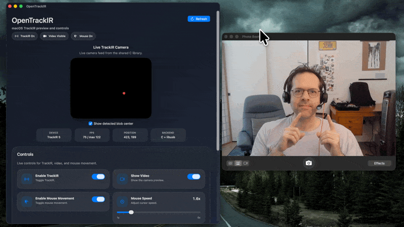

# OpenTrackIR

OpenTrackIR is an infrared head-mouse to move your cursor on macOS if you are disabled. OpenTrackIR is a reverse-engineering workspace for NaturalPoint TrackIR hardware, with the explicit goal of removing the dependency on NaturalPoint's proprietary SDK and making device support work cross-platform.

If you want to try the current macOS app, download it from the [releases page](https://github.com/stedwick/OpenTrackIR/releases).



The repo is organized by implementation target:

- `python/`: active protocol exploration, USB transport work, packet decoding, logging, and preview tooling.
- `c/`: reusable cross-platform C library for TrackIR protocol, frame reconstruction, and device control.
- `cpp/`: native C++ consumers and harnesses for the C library, including the OpenCV preview app.
- `mac/`: SwiftUI macOS app with live TrackIR preview controls, native mouse output, and a temporary bridge to the shared C sources.
- `win/`, `nix/`: platform-specific notes, adapters, or future integration work.
- `tmp/`: scratch output and temporary artifacts.

## Project goals

- Identify and document the TrackIR device protocol.
- Reproduce initialization, streaming, and shutdown behavior without vendor SDKs.
- Build portable code paths that can be shared across macOS, Linux, and Windows.
- Keep the reverse-engineered behavior testable with small, isolated units.

## Current Python work

The Python implementation currently contains:

- USB device discovery and transport helpers for the TrackIR 5 v3 hardware path.
- Packet extraction and decoding helpers for the sensor stream.
- A small CLI for identification, packet dumping, and preview rendering.
- Unit tests around transport encoding, packet recovery, stripe decoding, centroid math, and shutdown sequencing.

The Python workbench remains the fastest place to validate protocol ideas before porting stable behavior into the native library.

Useful Python CLI paths:

```sh
cd python
uv run python trackir_tir5v3.py opencv --log tmp/logs/opencv-manual.log
uv run python trackir_tir5v3.py log --log tmp/logs/log-manual.log
```

- `opencv`: live OpenCV preview window with centroid overlay.
- `log`: no OpenCV window; prints `x` and `y` once per second to the terminal.

## Working principles

- Prefer small, reversible changes over broad rewrites.
- Keep protocol knowledge in pure functions where possible.
- Add a focused unit test for each meaningful piece of business logic.
- Preserve raw observations in logs so assumptions can be checked against device behavior later.
- Avoid introducing dependencies on vendor SDKs, closed headers, or platform-locked assumptions.

## Status

This repository is an active reverse-engineering project, not a finished end-user product. Expect experimental code, incomplete platform parity, and evolving protocol understanding.

## Native Workbench

The native port now lives in:

- `CMakeLists.txt`: top-level native build entrypoint that wires the C and C++ subprojects together.
- `c/CMakeLists.txt`: C library, C tests, and C streaming harness targets.
- `cpp/CMakeLists.txt`: C++ consumer targets, including the OpenCV preview app.
- `c/include/opentrackir/tir5.h`: public C API for protocol helpers, frame reconstruction, and device control.
- `c/include/opentrackir/tir5_mouse.h`: shared centroid-to-cursor tracking and smoothing helpers.
- `c/include/opentrackir/tir5_session.h`: native session snapshot API for higher-level app consumers.
- `c/include/opentrackir/tir5_tooling.h`: shared CLI and FPS helper functions for native harnesses.
- `c/src/`: protocol/frame implementation, shared mouse/session/tooling helpers, plus the current `libusb` device backend.
- `c/examples/stream_dump.c`: simple C-only stream dumper that prints frame, packet, and centroid data.
- `c/tests/test_tir5.c`: unit tests for pure parsing, centroid/frame logic, mouse helpers, and native tooling helpers.
- `cpp/opencv_preview/main.cpp`: simple C++ OpenCV preview app that consumes the C API and serves as the first native hardware test harness.
- `mac/OpenTrackIR/TrackIRRuntimeController.swift`: persisted control state, lifecycle gating, timeout handling, and camera sync policy.
- `mac/OpenTrackIR/TrackIRCameraController.swift`: macOS-side session polling, preview publishing, and telemetry updates.
- `mac/OpenTrackIR/TrackIRMouseBridge.c`: Quartz event bridge for moving the macOS cursor from shared C mouse deltas.
- `mac/OpenTrackIR/TrackIRNativeSources.c`: temporary Xcode-side bridge that compiles the shared C sources into the app target.
- `PLAN-macOS-libusb-to-IOKit.md`: follow-on transport split plan for replacing the current macOS `libusb` path with an Apple-native backend.

The intended native split is:

- The C library owns protocol parsing, centroid math, frame reconstruction, session state, reusable mouse-tracker logic, and hardware transport.
- The C++ app owns preview rendering and native test-harness concerns on top of the public C API.
- The macOS app owns native Apple UI, preview/image presentation, app lifecycle, and Quartz mouse-event posting on top of the shared library.
- OpenCV stays out of the C library and out of the macOS app.

The intended build flow is:

```sh
cmake -S . -B build
cmake --build build
ctest --test-dir build
```

This is one native project with C and C++ subprojects under a shared top-level build tree.

## Native dependencies

- `libusb-1.0` is required for the native C library and device layer.
- OpenCV is required only for the C++ preview app.
- CMake is the supported native build entrypoint.

## macOS app status

The macOS project now streams real TrackIR data through the shared C session layer and includes:

- a live grayscale preview rendered with native Apple image APIs
- centroid, frame-rate, packet-type, and phase telemetry in the dashboard
- preview publishing that pauses when the window is hidden or inactive, with keep-awake-only background polling skipping snapshot reads and a host-side low-power mode engaging after 60 seconds of continuous hidden-window plus mouse-disabled idle time
- controls for TrackIR enablement, preview visibility, FPS caps, blob filtering, video transforms, keep-awake, and timeout behavior
- mouse movement driven by shared C tracking logic with a macOS Quartz event bridge
- a global keyboard shortcut to toggle mouse movement

The current macOS transport path is still temporary: the Xcode target compiles the shared C sources through `TrackIRNativeSources.c` and therefore still rides on the existing `libusb` backend. The planned transport split and IOKit migration are documented in [`PLAN-macOS-libusb-to-IOKit.md`](PLAN-macOS-libusb-to-IOKit.md).

## Windows app status

The WinUI Windows app now has a native runtime path that is wired for the shared C session API and live preview rendering. The Windows UI expects an `opentrackir.dll` built from the shared native library to be present next to the app at runtime; until that native DLL is available, the app shows a native-runtime-missing error state instead of a live TrackIR feed.

## macOS app build and run

Open the app in Xcode:

```sh
open mac/OpenTrackIR.xcodeproj
```

Then select the `OpenTrackIR` scheme and press Run.

To build from the terminal:

```sh
cd /Users/philip/src/OpenTrackIR
xcodebuild -project mac/OpenTrackIR.xcodeproj -scheme OpenTrackIR -destination 'platform=macOS' build
```

To run only the macOS unit tests:

```sh
cd /Users/philip/src/OpenTrackIR
xcodebuild -project mac/OpenTrackIR.xcodeproj -scheme OpenTrackIR -destination 'platform=macOS' test -only-testing:OpenTrackIRTests
```

To run the full macOS suite, including UI tests:

```sh
cd /Users/philip/src/OpenTrackIR
xcodebuild -project mac/OpenTrackIR.xcodeproj -scheme OpenTrackIR -destination 'platform=macOS' test
```

To run the built app from Finder, use Xcode's Product > Show Build Folder, then open `OpenTrackIR.app`.

If you want to launch it from the terminal after building:

```sh
open ~/Library/Developer/Xcode/DerivedData/OpenTrackIR-*/Build/Products/Debug/OpenTrackIR.app
```

If `libusb-1.0` and OpenCV are available, the preview target is built alongside the C library and tests.

## macOS permissions troubleshooting

The macOS app currently crosses two separate privacy boundaries:

- Cursor movement uses Quartz post-event access through `CGRequestPostEventAccess()` in `mac/OpenTrackIR/TrackIRMouseBridge.c`.
- The optional X-keys foot pedal fast-mode integration opens the HID device through `IOHIDDeviceOpen()` in `mac/OpenTrackIR/XKeysFootPedalMonitor.swift`.

If the cursor stops moving after rebuilding or changing signing, the usual cause is stale TCC trust for the current app signature rather than a TrackIR transport failure. The app bundle identifier is `philsapps.OpenTrackIR`, so the practical reset is:

```sh
tccutil reset All philsapps.OpenTrackIR
```

Then fully quit `OpenTrackIR`, remove any stale `OpenTrackIR` entry from System Settings > Privacy & Security > Accessibility, relaunch the current build, and re-approve it there when prompted. If you use the X-keys foot pedal, also approve Input Monitoring if macOS asks.

The `IOHIDDeviceOpen` TCC denial from the X-keys monitor does not directly block TrackIR cursor movement. It disables the optional foot-pedal fast mode, while stale Quartz post-event permission prevents mouse movement.

## Native run commands

Run the C unit tests:

```sh
cd /Users/philip/src/OpenTrackIR
cmake -S . -B build
cmake --build build --target test_tir5
./build/c/test_tir5
```

Run the Python unit tests from the managed environment:

```sh
cd /Users/philip/src/OpenTrackIR/python
uv sync
uv run python -m unittest discover -s tests -v
```

Run the C text streaming harness:

```sh
cd /Users/philip/src/OpenTrackIR
cmake -S . -B build
cmake --build build --target opentrackir_stream_dump
./build/c/opentrackir_stream_dump
./build/c/opentrackir_stream_dump --fps 60
```

Run the C++ OpenCV preview harness:

```sh
cd /Users/philip/src/OpenTrackIR
cmake -S . -B build
cmake --build build --target opentrackir_preview
./build/cpp/opentrackir_preview
./build/cpp/opentrackir_preview --fps 60
```
